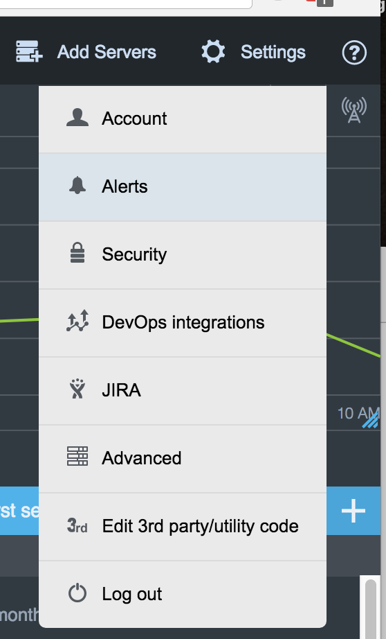
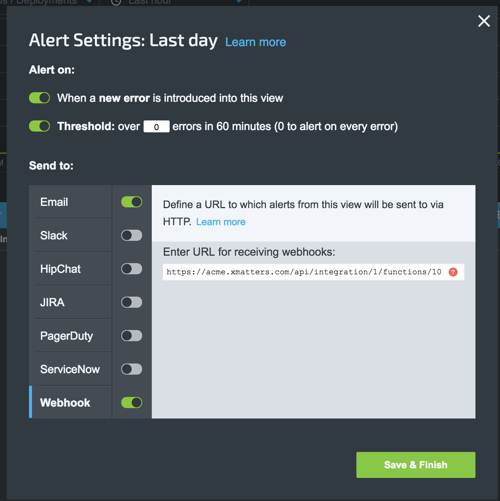

# OverOps
[OverOps](https://www.overops.com/) is a leading monitoring solution that provides direct insight into code level issues. This integration leverages the [Webhook alerts](https://support.overops.com/hc/en-us/articles/115000468747-Outgoing-Webhook-Integration) to fire events into xMatters. 

# Pre-Requisites
* OverOps Account 
* xMatters account - If you don't have one, [get one](https://www.xmatters.com)!

# Files
* [OverOpsCommPlan.zip](OverOpsCommPlan.zip) - Communications plan with inbound integration and message templates

# Installation

## xMatters set up
1. Login to the xMatters instance as a developer and navigate to the Developer tab. 
2. Next to the OverOps communications plan, click Edit > Integration Builder and expand the Inbound Integrations.
3. Click on the `Inbound from OverOps` script and copy the inbound url at the bottom. Save this for later. 
4. Click on the Forms tab and under the `New Exception` form click Edit > Layout. Enter the default recipients and click Save Changes. (An alternative to defaulting the recipients is to create a new [Subscription Form](https://help.xmatters.com/OnDemand/xmodwelcome/communicationplanbuilder/subscriptionforms.htm?cshid=SubscriptionFormListPlace))

## OverOps set up
1. Login to OverOps and click Settings > Alerts:

<kbd>
   
</kbd>

2. Under one of the alerts, click the Send to entry and click Advanced Settings. 

<kbd>
   
</kbd>

3. Click the slider switch next to Webhook and paste in the url copied from the xMatters Comm Plan. 

<kbd>
	
</kbd>
4. Click Save & Finish. 
   
# Testing
If everything is correctly configured, then when an error is thrown by code that is watched by OverOps, the webhook will fire into the xMatters integration builder, the script will run and a new event will be created, targeting the default recipient and notifications will be sent out. 
There will be two response options:
1. Acknowledge - Acknowledge the notification and stop device and group escalations
2. Ignore - Ignore the notification and immediately escalate to the next recipient in the group. 

# Troubleshooting
The first step of troubleshooting would be to enable the Email notification type in the Alert. This will send an email as well as the webhook. If the code faults and no email is sent, then OverOps is not triggering the Alert. 

If the email is sent, then investigate the Activity Stream in the Inbound Integration. If an entry corresponds with roughly the time the email from OverOps was sent, then check for any errors. 

If there are no errors and an event was created then note the event ID and track down that event in the Event Report. The Event Log will have any other information about who was notified. 

